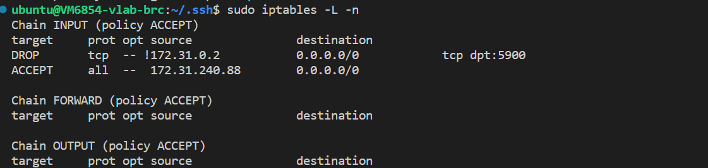
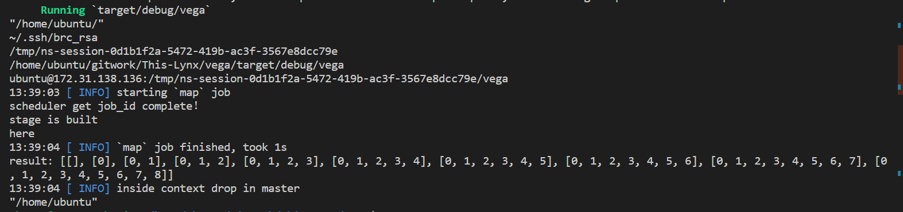

# 多机部署指南
### vlab多机内网互联
**环境**
vlab平台上提供的linux虚拟机。
示例中使用两台机器：VM6097与VM6854。内网ip地址分别为：172.31.240.88与172.31.138.136。

**hosts.conf文件**
在各台主机上均需要有相同的hosts.conf文件，且均放置于家目录下。
文件格式如下：
```
master = "master的ip : 任意的可用端口"
[[slaves]]
ip = "期望登录的slave1的账户 @ slave1 的ip"
key = "slave1 对应的ssh私钥"
[[slaves]]
ip = "期望登录的slave2的账户 @ slave2 的ip"
key = "slave2 对应的ssh私钥"
......
```
注意：master处不能填写"127.0.0.0"等自机ip，需要填写slave能够连接到的master的内网ip。
在我们的例子中，VM6097作为master，VM6854作为slave。hosts.conf文件如[hosts.conf](../../config_files/hosts.conf)所示。

**ssh设置**
在master下运行命令`ssh-keygen`（注意：询问“Enter file in which to save the key”时，输入期望的地址及合适的密钥名）将该密钥对中的私钥的地址同步到hosts.conf文件中。将公钥复值到期望连接的slave的目录"~/.ssh/"下，并将公钥中的内容复制添加到文件"~/.ssh/authorized_keys"中（如果没有该文件，则新建文件）。
下面进行权限的设置：
在master的"~/.ssh/"目录下运行命令：
```
> chmod 600 私钥名
//（示例中为chmod 600 brc_rsa）
> chmod 700 ~/.ssh
```
在slave的"~/.shh/"目录下运行命令：
```
> chmod 600 authorized_keys
> chmod 700 ~/.ssh
```
至此ssh已经配置成功，可以通过命令"ssh -i 密钥地址 目标ip"来测试ssh是否正常工作。

注意：每个密钥对只能用于一个slave，即对每个slave都需要进行上面的整个配置流程。

**TCP测试**（一般情况下可跳过）
两台机器可以通过以下方式测试TCP连接是否正常：
slave上运行：
```
> nc -l 端口
//（如10000，要求端口可用，即大于1024并且未被占用）
```
正常情况下，slave会进入监听对应端口的状态中。
接着，master上运行：
```
> nc slave的ip地址 对应的端口
```
正常情况下，进入可发送信息的状态。如果发送的信息可以在slave上收到并显示，则没有问题。

如果出现了问题，则需要检查两台机器的TCP连接设置等。下面为可供参考的设置为防火墙设置：
在slave下执行
```
> iptables -A INPUT -s master的ip -j ACCEPT
> iptables -L -n
//以上指令可能需要添加sudo给予权限
```
参考的输出为：


**TimeOut设置**（一般情况下可跳过）
可以在代码文件[TimeOutConfig](../../src/scheduler/distributed_scheduler.rs)中，搜索"executor @{} not initialized"，或在大约440行处，通过配置代码`tokio::time::delay_for(Duration::from_millis(TimeOut)).await;`中的TimeOut参数（单位为ms），来控制组网时对网络延迟的容忍度。当某slave超过5次在TimeOut ms内没有传回消息，master即认为该slave已下线。请根据网络情况与容忍程度合理配置该参数，参数过低可能会导致运行出现故障。
这里处于测试目的与网络状况，选择了200ms。

**运行**
slaves保持开机状态，在master中，设置环境变量DEPLOYMENT_MODE后运行程序。示例的命令如下：
```
//在工作目录下
> export VEGA_DEPLOYMENT_MODE=distributed
> cargo run
```
即可在分布式模式下运行，对于我们的例子（以make_rdd.rs为测试文件），结果如下：

