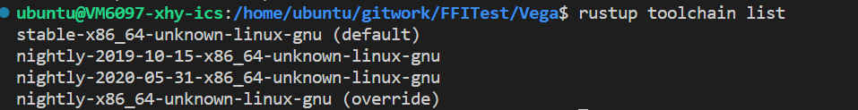
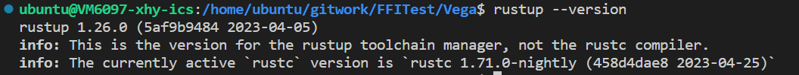

以下为我个人编译vega时的经验，不保证成功。如有问题，请在群中详细询问或自己解决。(为本机运行，多机运行需要修改hosts.conf等，暂不考虑)

1. 推荐使用linux系统运行（windows系统可以尝试，但可能在部分环节略有不同，需要自己摸索）
2. 从该仓库抓取修改过后的版本，原代码中的问题应该已经解决了。
3. 关于rust的版本，请选择 rust nightly ，具体版本请参考这里：
   
   
   推荐rustup default stable（日常开发用稳定版），在vega目录下`rustup override set nightly`重载为nightly格式。
4. 如果出现`error: failed to run custom build command for `openssl-sys v0.9.52`错误，请按照提示下载openssl即可：
```doc
    # On Ubuntu
    sudo apt-get install libssl-dev
    # On Arch Linux
    sudo pacman -S openssl
    # On Fedora
    sudo dnf install openssl-devel
```
如果下载后仍有此错误，解决方法未知。

5. 在家目录下(`echo $HOME`)，创建hosts.conf文件，内容同[config](../../config_files/hosts.conf)
6. 需要安装capnpc（根据错误提示安装(似乎需要sudo apt-get install)）
7. 通过`cargo run`（main.rs文件已添加，为make_rdd.rs内容）或`cargo run --example make_rdd`(测试文件在"../../examples"文件夹中，这里以make_rdd.rs示例)

**欢迎提出问题与补充**